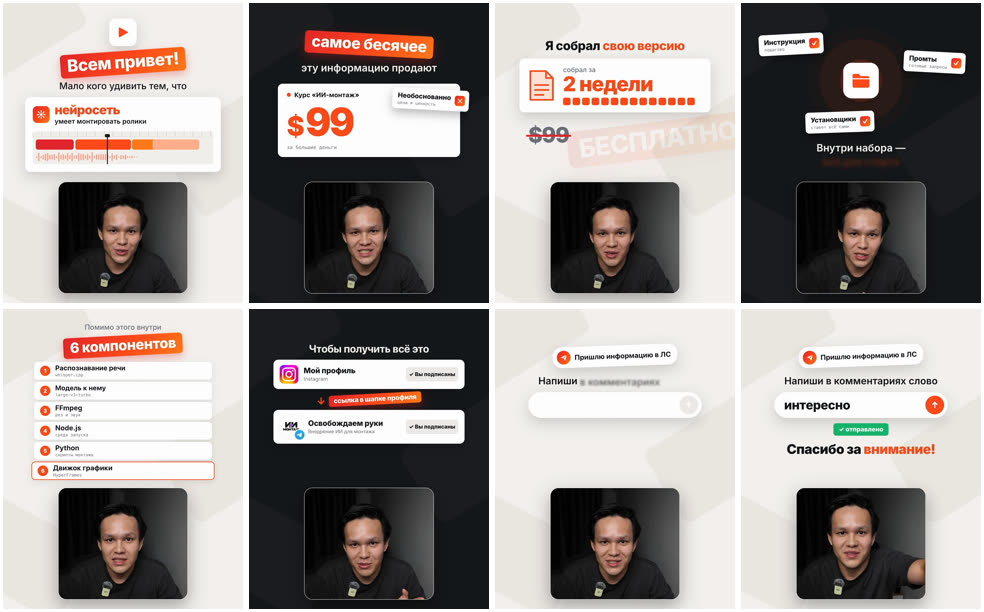
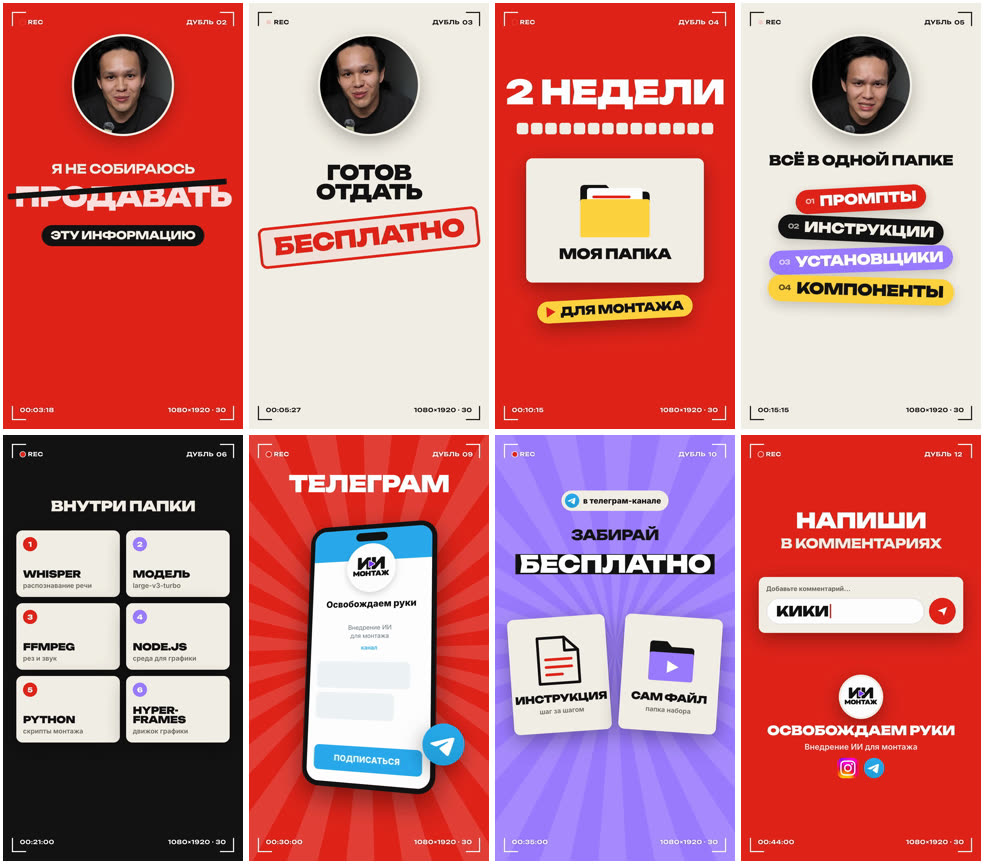
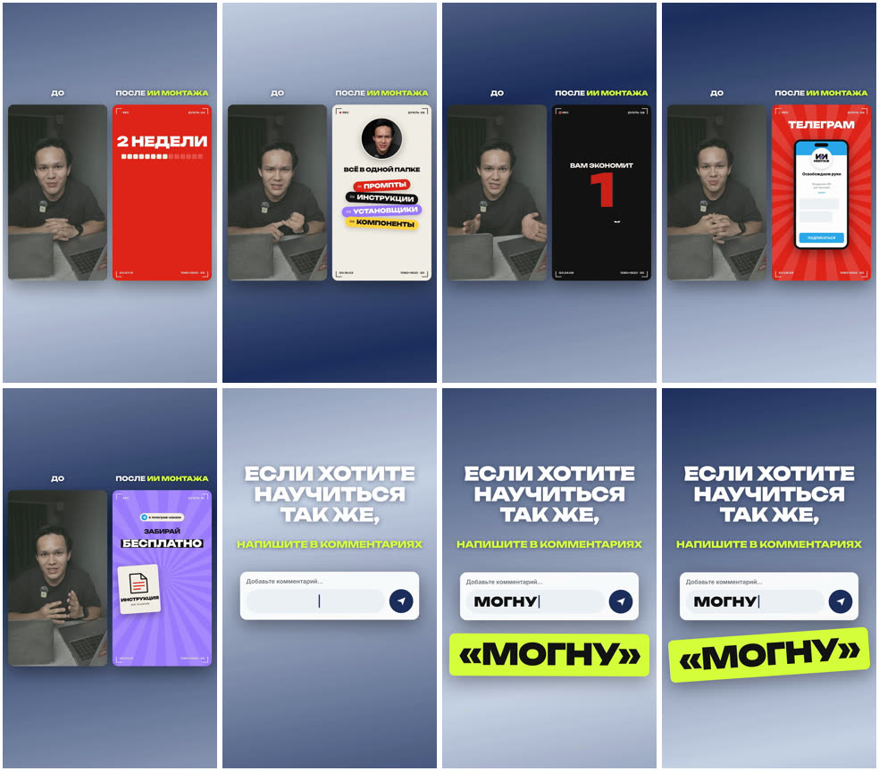
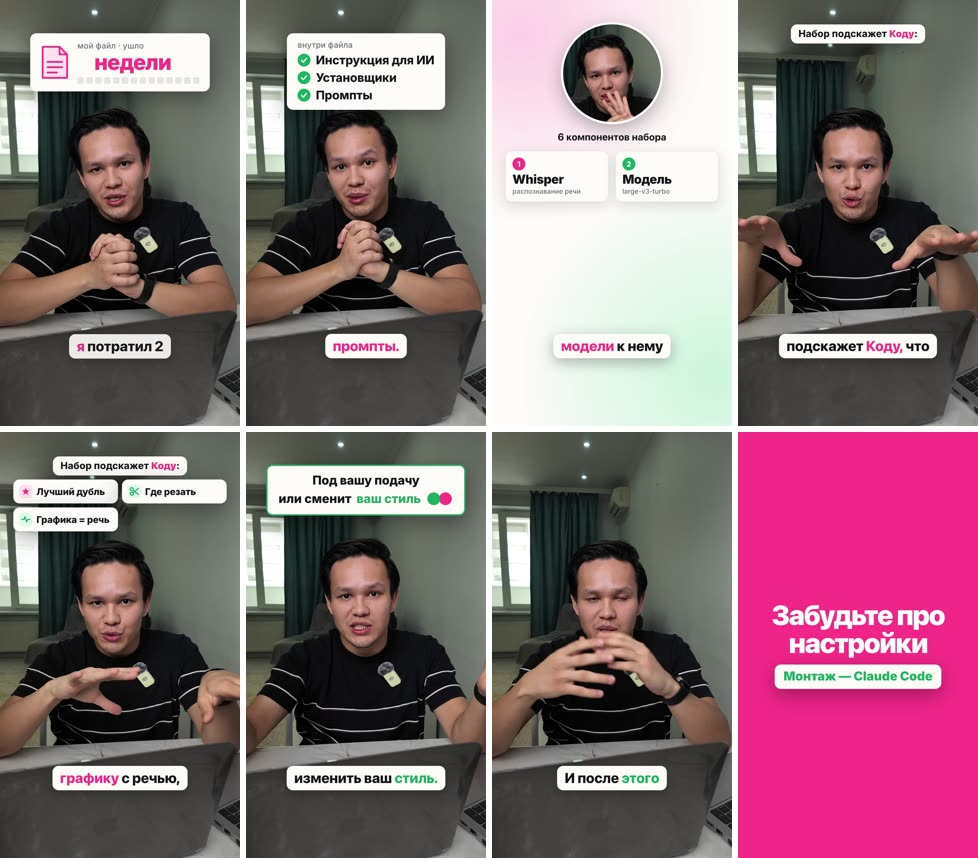

# Витрина стилей

Готовые ролики, смонтированные этим набором. Понравился стиль — положите свои записи
в `projects/<имя>/`, откройте эту папку в Claude Code и отправьте промпт под картинкой.
Цвета, тексты и формат можно поменять тем же сообщением.

### Explainer: спикер в окне снизу, графика сверху
Кадр 4:5. Светлые и тёмные сцены чередуются, оранжевый акцент; цены с одометром,
списки-шаги, карточки соцсетей, поле ввода в конце.



```
Смонтируй ролик как в образце explainer-window. Видео: <файлы>.
```

### Промо-моушн: красный, крем, рамка камеры
9:16. Крупные слова капсом (шрифт Unbounded), рамка REC с номером дубля, спикер в круге и в телефоне,
лучи, плашки, энд-кард с кодовым словом в комментариях.



```
Смонтируй ролик как в образце promo-motion. Видео: <файлы>.
```

### До / после
9:16. Сырая запись и готовый ролик рядом на переливающемся фоне, в конце призыв во весь экран.
Сначала монтируется сам ролик, потом из него и рез-без-графики собирается сравнение.



```
Сделай сравнение до / после как в образце raw-vs-edited из моего ролика projects/<имя>.
```

### Базовый: спикер во весь кадр, светлые панели, субтитры
9:16. Стиль набора по умолчанию: белые панели над спикером, субтитры-плашки,
удары цветом на весь экран.



```
Смонтируй ролик как в образце basic. Видео: <файлы>. Цвета: <два цвета>.
```

### Стикер-клип под песню
Пока только разбор, без примера: `sticker-song/ref.md`.

---

# Как устроены образцы (для Claude)

Каждый образец — папка `references/<имя-латиницей>/`:

```
ref.mp4          образец (кладёт человек)
ref.md           разбор (пишет Claude по шаблону ниже)
storyboard.jpg   раскадровка 8 кадров
example.jpg      пример — ролик автора набора в этом стиле (для витрины)
transcript.srt   расшифровка образца (если в нём есть речь)
```

Видео и раскадровка образца — чужой материал: они остаются на компьютере и в репозиторий
не публикуются (`.gitignore`). Поэтому `ref.md` пишется так, чтобы по нему можно было работать без них.

## Команда «разбери образец»

1. `python tools/preflight.py`, потом `source setup/env.sh`.
2. Замерь образец: ffprobe (кадр, fps, длительность), `ffmpeg -af ebur128` (громкость).
3. Раскадровка: `ffmpeg -i ref.mp4 -vf "fps=8/<длит>,scale=270:-2,tile=8x1" -frames:v 1 storyboard.jpg`.
   Если сцен больше восьми, сделай вторую раскадровку плотнее и посмотри на неё сам.
4. Расшифровка: whisper из `kit.json`, `-l auto`. Если речи нет, whisper выдаёт галлюцинации
   («Субтитры сделал…», «Редактор субтитров…»). Такие строки помечай в `ref.md` как мусор.
5. Посмотри раскадровку глазами. Сними палитру и шрифты, перечисли сцены и компоненты.
6. Для каждого компонента сверься с [components/README.md](../components/README.md) и поставь статус:
   - **есть** — компонент уже есть в библиотеке, укажи файл;
   - **кодом** — пишется на HTML/GSAP в проекте, ничего не нужно;
   - **от человека** — нужны картинки, логотипы, шрифты, футаж, музыка;
   - **скачать** — модель, шрифт, блок каталога HyperFrames или скилл. Укажи источник и размер
     и спроси разрешения (см. CLAUDE.md, раздел «Загрузки»).
7. Запиши `ref.md` по шаблону и покажи человеку итоговый список «от человека» и «скачать».

## Команда «сделай как в образце <имя>»

Работаешь в `projects/<проект>/` по `docs/2-PROMPT-EDIT.txt`, но:
- ответы на 4 стартовых вопроса бери из раздела «Раскладка» в `ref.md`, если человек не сказал иначе;
- сцены и компоненты бери из `ref.md` и `components/`, а не придумывай заново;
- если структура ролика не про говорящую голову (песня, промо без речи),
  смотри раздел «Пайплайн» в `ref.md`: там написано, какие шаги пропустить;
- каждый новый компонент, написанный для ролика, после приёмки сохрани в `components/`
  и добавь строку в каталог `components/README.md`. В `ref.md` смени его статус на **есть**.

## Шаблон ref.md

```markdown
# <имя> — <одна строка: что за ролик>
Источник: ref.mp4 · <WxH> · <fps> · <длит> с · <LUFS> · речь: <язык/нет>

## Раскладка (ответы на 4 стартовых вопроса)
Формат · Спикер · Главное в кадре · Стиль (палитра hex, шрифты)

## Пайплайн
Какие шаги 2-PROMPT-EDIT выполнять, какие пропустить и почему.

## Сцены
| # | Время | Фраза / событие | Компоненты | Статус |

## Компоненты
| Компонент | Статус | Где взять / как сделать |

## Нужно от человека
## Нужно скачать (с разрешения)
## Подводные камни
```
